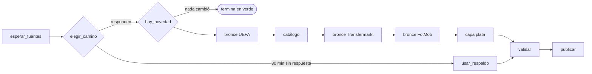

# Pipeline de fichajes — Ciencia de Datos, UTN FRM 2026

Construye un dataset donde **una fila es un fichaje**: un jugador que llegó a un
club europeo en una temporada, con sus estadísticas de la temporada **anterior**
al traspaso, y con los dos clubes —origen y destino— enriquecidos con el ranking
oficial de UEFA.

La variable objetivo es `es_destino_top_20`: si el club que lo compró está entre
los 20 primeros del coeficiente de clubes de UEFA de las últimas diez
temporadas.

## Documentación

Todo está en un solo documento, en dos formatos:

| Archivo | Para qué |
|---|---|
| [docs/Explicacion_Pipeline_Fichajes.pdf](docs/Explicacion_Pipeline_Fichajes.pdf) | **el documento para leer y compartir**: qué cambió, cómo funciona cada parte, el diagrama del DAG, el diccionario de columnas y la defensa oral |
| [docs/EXPLICACION.md](docs/EXPLICACION.md) | la misma documentación en markdown. Es la **fuente**: se edita acá |
| [docs/generar_pdf.py](docs/generar_pdf.py) | regenera el PDF a partir del markdown (`py docs/generar_pdf.py`) |

## Las tres fuentes

| Fuente | Qué aporta | Acceso |
|---|---|---|
| **UEFA** | ranking y coeficiente de clubes (10 temporadas) y de asociaciones | API JSON pública, `comp.uefa.com` |
| **Transfermarkt** | el fichaje: jugador, origen, destino, importe, edad, liga | HTML, dominio internacional |
| **FotMob** | el rendimiento previo: 56 métricas por torneo | API interna, JSON |

## Las capas

```
include/bronze/     el byte tal como vino, comprimido y particionado
include/silver/     dataset_fichajes_silver.csv + dim_clubes.csv + dim_clubes_sin_cruce.csv
include/output/     el entregable fechado de cada corrida
include/frozen/     respaldo congelado, por si las fuentes no responden
```

Ninguna se versiona: se regeneran corriendo el DAG.

## Cómo levantarlo

Hace falta **Docker Desktop** corriendo y **Astro CLI** instalado.

```bash
astro dev start
```

La primera vez tarda unos minutos. Después, `localhost:8080` — usuario `admin`,
contraseña `admin`.

### La primera corrida

1. **Dejalo pausado** y disparalo a mano: *Trigger DAG w/ config* →
   `modo = prueba`. Baja sólo el top 20 de UEFA y una temporada; termina en
   minutos y sirve para ver el grafo moverse entero.
2. Mirá la vista *Graph*: van a aparecer 20 instancias de la misma tarea, cada
   una con el nombre de su club, corriendo de a cuatro. Eso es `.expand()` en
   vivo.
3. En modo prueba, `validar_dataset_plata` **va a fallar a propósito**: con 20
   clubes el dataset no llega al mínimo de 1000 filas. No es un bug, es la
   validación haciendo su trabajo — y por eso `publicar` no corre.
4. **Disparalo de nuevo sin cambiar nada.** Esta vez termina en segundos y casi
   todo queda en gris. No falló: `hay_novedad` se dio cuenta de que las fuentes
   están igual y cortó. La corrida que no hace nada también es un resultado.
5. Cuando quieras el dataset completo: `modo = normal`. Con los valores por
   defecto (200 clubes, 3 temporadas) son unas 600 páginas de Transfermarkt y
   varios miles de consultas a FotMob: **calculá un par de horas la primera
   vez**. Las siguientes reusan el bronce.

> ⚠️ **Despausar el DAG dispara una corrida enseguida, con los parámetros por
> defecto** — o sea los 200 clubes y las 3 temporadas, no lo que hayas elegido
> en el formulario. Despausalo cuando estés listo para esa corrida larga, no
> antes.

> ⚠️ **La capa bronce vieja del Drive ya no sirve** y no se puede convertir: no
> contiene el HTML de Transfermarkt, así que de ahí no salen ni la liga del club
> de origen, ni el id del club, ni la edad real al fichaje. Hay que regenerarla.
> Ver la sección 4 del documento de explicación.

### Parámetros de corrida

| Parámetro | Por defecto | Qué hace |
|---|---|---|
| `modo` | `normal` | `prueba` pisa todo: top 20 y una temporada |
| `tope_ranking_uefa` | `200` | hasta qué puesto del ranking UEFA se procesan clubes de destino |
| `temporadas_hacia_atras` | `3` | cuántas temporadas de fichajes, desde la actual |
| `anio_uefa` | `2027` | ventana del ranking de diez años. Fijarlo hace la corrida reproducible |
| `forzar` | `false` | ignora la huella de frescura y vuelve a pedir todo |

## Probar sin levantar Airflow

Para depurar el parseo sin esperar a los contenedores:

```bash
py -m include.fichajes.prueba_local --clubes 3 --temporadas 1
```

Agregá `--sin-fotmob` para saltear el paso lento.

## El grafo



La versión completa del diagrama, con la regla de disparo de cada tarea, está en
la sección 7 del documento de explicación.
