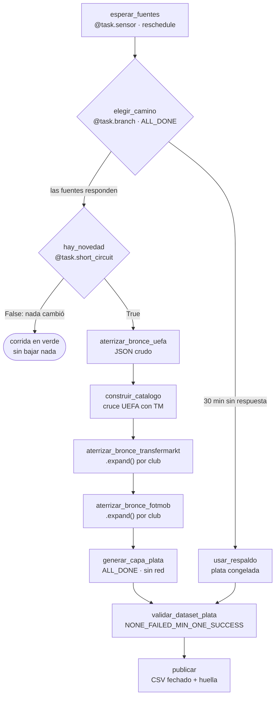

# Pipeline de Datos: Fichajes y Coeficientes UEFA

**Cómo funciona el proyecto — arquitectura, flujo de datos y los cambios de esta
versión**

Ciencia de Datos · UTN FRM · 2026

---

## Contenido

1. Qué cambió en esta versión
2. Qué problema resuelve el proyecto
3. Arquitectura y estructura del repositorio
4. Qué se guarda exactamente en cada capa
5. Las tres fuentes de datos
6. El DAG paso a paso, con los conceptos de Airflow
7. Diagrama del flujo completo
8. Cómo se cruzan los nombres de club (tokenización)
9. Cómo correrlo: modo prueba y prueba local
10. Validación de calidad de datos
11. Unidad de análisis y diccionario de columnas
12. Lo que hay que saber explicar (defensa oral)
13. Glosario rápido de Airflow

---

## 1. Qué cambió en esta versión

Diez cambios de fondo. Tres salieron de las correcciones del profesor; los
otros siete aparecieron al revisar los datos y el código.

| # | Qué cambió | Antes | Ahora |
|---|---|---|---|
| 1 | **El DAG se dispara solo** | `schedule=None`: había que apretar el botón | `schedule="0 6 * * *"`, y decide si trabajar comparando una huella de las fuentes |
| 2 | **Se guarda el bronce de Transfermarkt** | el HTML se parseaba en memoria y se tiraba | se guarda el HTML crudo comprimido, particionado por club y temporada |
| 3 | **Clubes de origen enriquecidos** | sólo el nombre del club | país, liga, ranking y coeficiente UEFA, si es europeo, si es top 20/50, y tres columnas derivadas del par origen-destino |
| 4 | **El top 20 sale de UEFA** | los primeros 20 del ranking de Transfermarkt | coeficiente de clubes de UEFA de las últimas diez temporadas |
| 5 | **Qué filas entran al dataset** | sólo los fichajes con importe publicado | todos los fichajes; se saca únicamente lo que no es un fichaje (sección 11.2) |
| 6 | **Los filiales no heredan el ranking** | "Chelsea FC U21" cruzaba contra Chelsea y quedaba como club top 10 | se detectan y se marcan aparte (sección 11.3) |
| 7 | **La clave primaria** | `(jugador_tm_id, temporada_fichaje)`, que perdía traspasos | `operacion_id`, el id del traspaso en Transfermarkt |
| 8 | **Las métricas del resumen ya no se pierden** | si FotMob no mandaba el detalle, se descartaba también el resumen | se conserva lo que haya llegado (sección 12.3) |
| 9 | **Menos columnas, y ninguna repetida** | seis columnas que repetían lo que ya decía otra | se sacaron; el linaje pasó de tres columnas a una (sección 11.4) |
| 10 | **Una sola corrida a la vez** | dos corridas simultáneas consolidaban el bronce de la otra a medio escribir | `max_active_runs=1` (sección 9.3) |

Además hubo seis correcciones de datos que aparecieron en el camino y están
explicadas en la sección 12.2.

> **Importante para el equipo**
>
> **La capa bronce vieja del Drive ya no sirve**, y no se puede convertir: no
> contiene el HTML de Transfermarkt, así que de ahí no se puede sacar ni la liga
> del club de origen, ni el id del club, ni la edad real al fichaje. Hay que
> regenerarla corriendo el DAG.

---

## 2. Qué problema resuelve el proyecto

El objetivo es construir un dataset de fichajes donde **cada fila combine dos
cosas que viven en fuentes distintas**:

- **el traspaso**: quién fue transferido, de qué club a qué club, por cuánto
  dinero, y qué clase de club es cada uno;
- **el rendimiento previo**: cómo venía jugando ese jugador en la temporada
  **anterior** al traspaso (minutos, goles, xG, precisión de pases…).

Con eso se puede estudiar la pregunta del proyecto: qué distingue a un fichaje
que termina en un club de élite de uno que no. La variable objetivo es
`es_destino_top_20`.

Construirlo a mano no escala —son miles de fichajes en varias temporadas— así
que se arma con un pipeline de extracción y transformación orquestado con
**Apache Airflow**.

---

## 3. Arquitectura y estructura del repositorio

El proyecto corre sobre **Docker**, usando **Astro CLI** (la herramienta de
Astronomer que levanta un entorno de Airflow completo con un solo comando:
`astro dev start`). Eso crea varios contenedores: el `api-server` (la interfaz
en `localhost:8080`), el `scheduler` (el proceso que decide cuándo correr cada
tarea), el `dag-processor` (el que lee la carpeta `dags/`) y una base Postgres
con la metadata de Airflow.

```
airflow-proyecto/
├── dags/
│   └── dag_fichajes.py        define el DAG: 11 tareas y sus dependencias
├── include/
│   ├── fichajes/              la lógica pesada, separada en módulos
│   │   ├── bronce.py          rutas y escritura de la capa cruda
│   │   ├── uefa.py            cliente de la API de coeficientes de UEFA
│   │   ├── transfermarkt.py   descarga y parseo del HTML
│   │   ├── fotmob.py          cliente de la API de estadísticas
│   │   ├── clubes.py          cruce de nombres UEFA con Transfermarkt
│   │   ├── plata.py           bronce al dataset consolidado
│   │   ├── esquema.py         columnas, tipos y umbrales de validación
│   │   └── prueba_local.py    corrida chica sin Airflow
│   ├── bronze/                capa cruda (no se versiona en git)
│   ├── silver/                dataset consolidado (no se versiona)
│   ├── output/                el entregable fechado de cada corrida
│   └── frozen/                respaldo congelado
└── docs/
```

> **Por qué la lógica no vive en `dags/`**
>
> El `dag-processor` vuelve a parsear la carpeta `dags/` **cada pocos
> segundos**, así que ahí va sólo la definición del flujo. Todo lo que sea
> trabajo de verdad vive en `include/` y se importa. Es también la razón de que
> un DAG nuevo tarde unos segundos en aparecer en la interfaz: no está roto,
> está esperando a que el procesador vuelva a escanear la carpeta.

### 3.1 Qué hace cada módulo

| Módulo | Responsabilidad | Detalle |
|---|---|---|
| `bronce.py` | dónde y cómo se guarda el crudo | arma las rutas particionadas, escribe y lee `.gz`, y define la regla de qué es inmutable |
| `uefa.py` | cliente de la API de coeficientes | pagina la API, devuelve los 554 clubes y las 55 asociaciones, y aplana el JSON a filas |
| `transfermarkt.py` | descarga y parseo del HTML | funciones `bajar_*` (tocan la red, devuelven HTML) separadas de `parsear_*` (no tocan la red) |
| `fotmob.py` | cliente de estadísticas | busca al jugador, desambigua entre homónimos y arma el registro de la temporada |
| `clubes.py` | el cruce por nombre | normaliza, bloquea por país y compara; también responde "¿este país es europeo?" |
| `plata.py` | bronce a dataset | lee las tres capas crudas, aplana, limpia, enriquece, deduplica y escribe el CSV |
| `esquema.py` | el contrato del dataset | la lista de columnas y los umbrales en un solo lugar |

La separación entre `bajar_*` y `parsear_*` en `transfermarkt.py` no es
cosmética: es lo que permite que la capa plata se pueda correr cien veces
mientras se depura el parseo, **sin pedirle nada a Transfermarkt**.

---

## 4. Qué se guarda exactamente en cada capa

El proyecto sigue la **arquitectura Medallion**, que organiza los datos en capas
de calidad creciente.

### 4.1 Capa bronce — `include/bronze/`

Los datos **tal como los devolvió la fuente**, sin interpretar. Todo comprimido
con gzip, y con la partición en la **ruta** y no en el nombre del archivo — es
el mismo particionado que usa cualquier data lake sobre S3, con carpetas en
lugar de prefijos de bucket.

Son cuatro tipos de archivo:

| Ruta | Qué contiene | Cuántos hay |
|---|---|---|
| `uefa/actualizacion=<fecha>/clubes_diez_temporadas.json.gz` | la respuesta JSON completa de la API de UEFA: 554 clubes con su posición, coeficiente, país, id y las cuatro formas de su nombre | uno por cada actualización del ranking |
| `uefa/actualizacion=<fecha>/asociaciones.json.gz` | las 55 asociaciones miembro de UEFA con su posición y coeficiente de país | uno por actualización |
| `transfermarkt/ranking/actualizacion=<fecha>/pagina_NN.html.gz` | el HTML del ranking de clubes de Transfermarkt, página por página. De acá salen los **ids y slugs**, que son lo único que arma la URL de fichajes | unas 45 páginas por actualización |
| `transfermarkt/altas/club=<id>/temporada=<año>/altas.html.gz` | el HTML de la página de fichajes de **un club en una temporada**. Es la fuente del traspaso completo | uno por club y temporada |
| `fotmob/temporada=<año-año>/jugador_<id>.json.gz` | las estadísticas de **un jugador en una temporada**: biografía y métricas por torneo | uno por jugador y temporada |

Ejemplo real de cómo queda:

```
include/bronze/
  uefa/actualizacion=2026-09-17/clubes_diez_temporadas.json.gz
  uefa/actualizacion=2026-09-17/asociaciones.json.gz
  transfermarkt/ranking/actualizacion=2026-09-17/pagina_00.html.gz
  transfermarkt/ranking/actualizacion=2026-09-17/pagina_01.html.gz
  transfermarkt/altas/club=27/temporada=2026/altas.html.gz
  transfermarkt/altas/club=27/temporada=2025/altas.html.gz
  transfermarkt/altas/club=418/temporada=2026/altas.html.gz
  fotmob/temporada=2025-2026/jugador_860914.json.gz
  fotmob/temporada=2025-2026/jugador_776890.json.gz
```

**La regla del bronce es append-only**: lo que ya está en disco no se vuelve a
pedir. De ahí salen las dos propiedades que lo justifican:

1. **La fuente se toca una vez por dato, no una vez por corrida.** La segunda
   corrida sobre el mismo material no genera ni una request.
2. **Un bug en el parseo no obliga a volver a la fuente.** Si mañana descubrimos
   que estábamos leyendo mal la columna del importe, se corrige la capa plata y
   se reprocesa lo que ya está en disco. Sin bronce, ese arreglo significa
   scrapear todo de nuevo — y si el sitio cambió en el medio, los datos viejos
   no se recuperan nunca más.

Hay **una sola excepción deliberada** a la regla, explicada en la sección 6.6:
la página de la temporada en curso se vuelve a pedir, porque el mercado sigue
abierto.

### 4.2 Qué NO está en el bronce de FotMob

Vale la pena aclararlo porque cambió respecto de la versión anterior. El archivo
de FotMob guarda **sólo el rendimiento del jugador**: nada del fichaje.

```
antes:  bronce_lionel_messi_2023-2024.json
        (mezclaba club destino, coste, es_top_20 y métricas)

ahora:  fotmob/temporada=2023-2024/jugador_123456.json.gz
        (sólo biografía y métricas por torneo)
```

Los datos del traspaso viven en el bronce de Transfermarkt, que es de donde
salen. El beneficio concreto: si el mismo jugador aparece en dos fichajes
distintos, sus estadísticas de una temporada se piden **una sola vez**.

Contenido de un archivo de FotMob:

```json
{
  "jugador_fotmob_id": "860914",
  "jugador_tm_id": "480692",
  "nombre_tm": "Luis Díaz",
  "temporada_stats": "2024/2025",
  "match_metodo": "club_destino",
  "nombre_fotmob": "Luis Díaz",
  "club_actual_fotmob": "Bayern München",
  "candidatos": 3,
  "biografia": {
    "altura_cm": 178, "pais_fotmob": "Colombia",
    "pie": "Left", "edad_hoy": 28,
    "posicion_fotmob": "Left Winger"
  },
  "torneos": [
    { "nombre": "Premier League", "torneo_id": 47,
      "metricas": { "Goals": 13.0, "Minutes": 2695.0, "Rating": 7.21, ... } },
    { "nombre": "Champions League", "torneo_id": 42,
      "metricas": { "Goals": 3.0, "Minutes": 612.0, ... } }
  ]
}
```

### 4.3 Capa plata — `include/silver/`

Los datos **limpios, tipados y consolidados**. Tres archivos:

| Archivo | Qué es | Filas |
|---|---|---|
| `dataset_fichajes_silver.csv` | **el dataset**: una fila por fichaje, con el enriquecimiento de los dos clubes y las métricas del jugador | una por fichaje |
| `dim_clubes.csv` | la **dimensión de clubes**: los clubes que se van a procesar, con id de Transfermarkt, slug, nombre, país, posición y coeficiente de UEFA, y con qué método cruzó | una por club dentro del tope |
| `dim_clubes_sin_cruce.csv` | los clubes de Transfermarkt que **no** se pudieron cruzar contra UEFA, con el motivo | una por club sin cruce, de todo el catálogo |

El tercero es tan importante como los otros dos: es lo que nos permite decir en
la defensa cuántos clubes quedaron afuera y por qué, en vez de responder "no
sé".

> **Los dos archivos no cubren el mismo universo**
>
> `dim_clubes.csv` trae sólo los clubes **dentro del tope** que se pidió en la
> corrida (188 con `tope_ranking_uefa=200`), mientras que
> `dim_clubes_sin_cruce.csv` trae los que no cruzaron en **todo** el catálogo de
> Transfermarkt, tope incluido o no.
>
> Así que dividir uno por la suma de los dos **no da la cobertura del cruce**:
> mezcla un numerador recortado con un denominador que no lo está. La cobertura
> real está medida en la sección 8.5, sobre el catálogo completo.

### 4.4 Capa de salida — `include/output/`

Un CSV fechado por corrida: `fichajes_2026-09-17.csv`. Es una copia del dataset
de plata con la fecha de la corrida en el nombre, y es **el entregable**.

Que el nombre lleve la fecha y no un número correlativo es lo que hace la tarea
**idempotente**: correrla dos veces el mismo día sobrescribe el archivo, no deja
dos. Si numerara, cada reintento agregaría uno nuevo y el conteo final
dependería de cuántas veces falló.

### 4.5 Respaldo — `include/frozen/`

Dos archivos, y sólo uno se versiona:

- `ultimo_ok.csv` — lo reescribe cada corrida completa exitosa. Ignorado por git.
- `fichajes_semilla.csv` — viajaría con el repositorio para garantizar que el
  respaldo existe desde el primer clone.

> **Ojo con qué es este archivo**
>
> El respaldo **no es bronce**: es plata ya parseada. Sirve para salvar la
> corrida de hoy si las fuentes no responden, pero **no permite reprocesar
> nada**. El bronce es el que te salva de un bug en el parser.

### 4.6 Capa oro — no se construye acá

Sería el dataset ya listo para el modelo: features derivadas, agregados por
liga. Se arma en las unidades 3 y 4 sobre esta misma plata.

---

## 5. Las tres fuentes de datos

| Fuente | Qué aporta | Cómo se accede |
|---|---|---|
| **UEFA** | ranking y coeficiente de clubes (diez temporadas) y de las 55 asociaciones | API JSON pública |
| **Transfermarkt** | el fichaje completo: jugador, origen, destino, importe, edad, liga | HTML, hay que parsearlo |
| **FotMob** | el rendimiento previo: 56 métricas por torneo | API interna, JSON |

### 5.1 UEFA — de dónde sale la columna objetivo

La tabla que se ve en `es.uefa.com/nationalassociations/uefarankings/tenyears/`
la arma JavaScript, y además ese host **no le contesta a un cliente HTTP
pelado**: la conexión TLS se establece y el servidor no responde nunca (probado
con `urllib` y con `requests`). Scrapearla exigiría un navegador headless.

El mismo dato sale del backend que alimenta esa página, que sí responde y
devuelve JSON:

```
https://comp.uefa.com/v2/coefficients
    ?coefficientType=MEN_CLUB_TEN_YEARS   coeficiente de clubes, 10 temporadas
    &coefficientRange=OVERALL             acumulado, no una temporada suelta
    &seasonYear=2027                      ventana que termina en 2026/27
    &language=EN&page=1&pagesize=500
```

Los valores de esos dos enum salen del **contrato publicado de la API**
(`comp.uefa.com/v3/api-docs`), no de adivinar. Verificado contra la página:
Bayern 267.500, Real Madrid 246.500, Man City 240.500, Liverpool 239.000.

Devuelve 554 clubes y, lo más útil para nosotros, un campo `lastUpdateDate`: la
señal de frescura que usa el cortocircuito del DAG.

### 5.2 Transfermarkt — la fila trae más de lo que parece

Transfermarkt no tiene API pública, así que se usa scraping: se baja el HTML y
se parsea con `BeautifulSoup`. Lo importante es que **una fila de la tabla de
altas ya contiene todo lo necesario para describir el club de origen**, sin una
request extra:

```html
<a href="/fc-liverpool/startseite/verein/31" title="Liverpool FC">   id + slug
                          país
<a href="/premier-league/transfers/wettbewerb/GB1">Premier League     liga + código
```

Y del jugador: id de Transfermarkt, **edad al momento del fichaje**,
nacionalidad, posición y el id de la operación. Antes de este cambio, de todo
eso sólo se leía el nombre del club de origen.

> **Por qué el dominio internacional**
>
> Se usa `transfermarkt.com` y no `transfermarkt.com.ar`. El dominio en español
> **traduce los nombres de club** ("Bayern Múnich", "SSC Nápoles", "Estrella
> Roja de Belgrado", "Club Brujas"), y esos nombres traducidos no cruzan contra
> el ranking de UEFA: sobre el mismo conjunto de clubes, la cobertura del cruce
> cae de 96% a 89%. De paso, el importe viene en un formato mucho más simple de
> parsear: `€70.00m` contra `70,00 mill. €`.

### 5.3 FotMob — estadísticas y el problema de los homónimos

FotMob sí tiene endpoints internos accesibles que devuelven JSON, así que acá no
hay HTML que parsear:

| Endpoint | Para qué |
|---|---|
| `/api/data/search/suggest?term=` | buscar un jugador por nombre |
| `/api/data/playerData?id=` | perfil: edad, altura, país, pie hábil |
| `/api/data/playerStats?playerId=` | métricas detalladas de un torneo |

El problema real de esta fuente es el cruce: Transfermarkt da el nombre, FotMob
hay que buscarlo. Y **"Luis Díaz" devuelve tres jugadores distintos**: el del
Bayern, uno del Alajuelense y uno de Peñarol. La versión anterior del código se
quedaba siempre con la primera sugerencia, sin verificar nada — y un acierto
silencioso no se distingue de un error silencioso.

Ahora se desambigua con lo que ya sabemos del fichaje: la sugerencia trae el
club actual del jugador, así que se prefiere la que coincide con el club de
destino o con el de origen del traspaso. Cuando no hay forma de decidir se usa
igual la mejor sugerencia, **pero queda anotado el método** en el archivo de
bronce, en el campo `match_metodo`:

| Valor | Qué significa | Confianza |
|---|---|---|
| `club_destino` | la sugerencia coincide con el club al que fue | alta |
| `club_origen` | coincide con el club del que salió | alta |
| `unica_sugerencia` | FotMob devolvió un solo jugador con ese nombre | media |
| `primera_sugerencia` | había varios y no se pudo decidir | **el único dudoso** |

De los cinco valores, al dataset final llega sólo lo que cambia una decisión de
análisis: si el cruce fue dudoso o no. Eso es la columna `cruce_dudoso` (11.4).
Un cruce dudoso tiene que poder filtrarse después; lo que no se puede es no
saber cuáles son.

---

## 6. El DAG paso a paso, con los conceptos de Airflow

El DAG se llama `pipeline_fichajes` y encadena **11 tareas**. Cada una introduce
un concepto.

> **Concepto Airflow: DAG**
>
> Un DAG (*Directed Acyclic Graph*, grafo acíclico dirigido) es la unidad
> central de Airflow: describe un conjunto de tareas y el orden en que deben
> ejecutarse, sin ciclos. Se define con el decorador `@dag` sobre la función
> `pipeline_fichajes()`. **La última línea del archivo llama a esa función**: sin
> esa llamada el archivo se parsea sin errores y no aparece nada en la interfaz.
> Es uno de los olvidos más comunes.

### 6.1 `esperar_fuentes()` — `@task.sensor`

```python
@task.sensor(poke_interval=300, timeout=1800, mode="reschedule", soft_fail=True)
def esperar_fuentes(**context) -> PokeReturnValue:
    actualizado = uefa.ultima_actualizacion(params["anio_uefa"])
    huella_tm   = tm.huella_ultimos_traspasos(tm.bajar_ultimos_traspasos())
    ...
    return PokeReturnValue(is_done=True, xcom_value=huella)
```

> **Concepto Airflow: Sensor**
>
> Un sensor es una tarea que **espera a que se cumpla una condición** antes de
> dejar avanzar al resto del DAG. En vez de fallar si la condición no se cumple
> al instante, "tantea" (*poke*) cada cierto intervalo.
>
> - `poke_interval=300` — sondea cada 5 minutos.
> - `timeout=1800` — se rinde a la media hora. Un corte de diez minutos ya no
>   arruina la corrida del día.
> - `mode="reschedule"` — entre sondeo y sondeo **libera el worker** en vez de
>   tenerlo durmiendo. Con un sensor da igual; con cincuenta esperando, es la
>   diferencia entre un scheduler sano y uno tapado.
> - `soft_fail=True` — al agotarse el tiempo la tarea queda en `skipped` y no en
>   `failed`: que una fuente no conteste no es un error del pipeline, es una
>   condición que sabemos manejar.
>
> Los sensores son para lo que está **fuera del control del DAG**. Para esperar
> a una tarea del mismo DAG no hace falta un sensor: para eso están las
> dependencias.

Además de esperar, esta tarea **toma la huella de las fuentes** y la devuelve,
que es lo que después decide si hay trabajo.

### 6.2 `elegir_camino()` — `@task.branch`

```python
@task.branch(trigger_rule=TriggerRule.ALL_DONE)
def elegir_camino(**context) -> str:
    if context["ti"].xcom_pull(task_ids="esperar_fuentes"):
        return "hay_novedad"
    return "usar_respaldo"
```

> **Concepto Airflow: Branching**
>
> Una tarea `@task.branch` no devuelve datos: **devuelve el nombre de la tarea
> que sigue**. Airflow ejecuta esa rama y marca la otra como `skipped` — en la
> interfaz se ve en gris: no falló, no correspondía.

Corre con `ALL_DONE` porque la tarea de arriba **puede haber quedado en
skipped**, que es justamente el caso que tiene que manejar. Con la regla por
defecto nunca se ejecutaría cuando más falta hace.

### 6.3 `hay_novedad()` — `@task.short_circuit`

```python
@task.short_circuit
def hay_novedad(**context) -> bool:
    huella = dict(context["ti"].xcom_pull(task_ids="esperar_fuentes") or {})
    if params["forzar"]:
        return True
    huella["alcance"] = f"{tope}/{temporadas}"
    anterior = Variable.get("fichajes_ultima_huella", default=None)
    if anterior == _serializar(huella):
        return False        # nada cambió: no hay nada que hacer
    return True
```

> **Concepto Airflow: Short-circuit**
>
> Es una tarea que actúa como un "if" a nivel de todo el flujo: si devuelve
> `False`, todas las tareas que dependen de ella quedan en `skipped` en lugar de
> ejecutarse, y **la corrida termina en éxito**. La mayoría de las corridas de
> un pipeline sano no hacen nada, y eso está bien; lo que no está bien es no
> darse cuenta.

> **Concepto Airflow: Variable**
>
> Las Variables son un almacén clave-valor persistente en la base de metadata de
> Airflow, accesible desde cualquier DAG. Acá `fichajes_ultima_huella` es lo que
> le da **memoria** al pipeline entre corridas.

**Qué cambió acá, y por qué importa.** La versión anterior preguntaba "¿pasaron
24 horas?". Un reloj responde cuánto hace que corriste, **no si la fuente
cambió**: se podía correr a las 23:59 y otra vez a las 00:05 bajando exactamente
lo mismo, o saltearse un mercado entero por haber corrido esa mañana. Ahora se
compara una huella con cuatro componentes:

| Componente | De dónde sale | Qué detecta |
|---|---|---|
| `uefa_actualizado` | `lastUpdateDate` de la API de UEFA | que se recalcularon los coeficientes |
| `tm_ultimos` | hash de los ids de la página de últimos traspasos | que se registraron fichajes nuevos |
| `temporada_actual` | deducida de la fecha | que arrancó una temporada nueva |
| `alcance` | los parámetros de la corrida | que alguien pidió más clubes o más temporadas |

> **Por qué la sonda de Transfermarkt es la página de últimos traspasos**
>
> En la página del ranking de clubes se mueve el valor de mercado todo el
> tiempo: hashearla daría "hay novedad" en **todas** las corridas y el
> cortocircuito no cortaría nunca. La página de últimos traspasos cambia exacta
> y únicamente cuando se registra un traspaso, que es la pregunta que hay que
> responder.

Y hay un segundo arreglo, más sutil: **la marca se anota en la última tarea**,
recién cuando el dataset pasó la validación. Antes se anotaba dentro del propio
cortocircuito, así que una corrida que después fallaba dejaba igual al DAG
creyendo que ya había procesado el día.

### 6.4 `aterrizar_bronce_uefa()` — `@task` y XComs

```python
@task
def aterrizar_bronce_uefa(**context) -> dict:
    crudo = uefa.clubes_diez_temporadas(params["anio_uefa"])
    actualizado = (crudo.get("actualizado") or "")[:10]
    bronce.escribir_json(bronce.ruta_uefa_clubes(actualizado), crudo)
    ...
    return {"actualizacion": actualizado, "clubes": str(ruta_clubes), ...}
```

> **Concepto Airflow: TaskFlow API (`@task`) y XCom**
>
> El decorador `@task` convierte una función Python normal en una tarea. El
> valor que la función `return`ea se guarda automáticamente como un **XCom**
> (*cross-communication*): el mecanismo con el que Airflow pasa datos entre
> tareas, porque cada tarea corre en su propio proceso y no comparten memoria.
>
> Y si una tarea recibe como argumento el resultado de otra, **Airflow deduce la
> dependencia solo**: no hace falta declararla.

> **La regla del XCom: por ahí viajan metadatos, no datos**
>
> Los XCom se guardan en la base de metadata de Airflow, que está pensada para
> registrar el estado de las corridas, no para almacenar datos. Por eso las
> tareas de bronce devuelven **rutas de archivo**, no el HTML. Pasar megabytes
> de página por XCom satura la base, y es de los errores más comunes al empezar.

La partición usa la fecha de actualización que informa la propia UEFA, **no la
fecha de la corrida**: dos corridas del mismo snapshot escriben en la misma
carpeta y no se duplica nada.

### 6.5 `construir_catalogo()` — el catálogo de clubes a procesar

Hace dos cosas:

1. Baja el ranking de clubes de Transfermarkt **y lo guarda en bronce**. De esa
   página sólo se usan el id y el slug; la posición la pone UEFA.
2. Cruza las dos fuentes por nombre (sección 8) y escribe `dim_clubes.csv` junto
   con el archivo de los que no cruzaron.

Devuelve la lista de clubes ordenada **por ranking de UEFA**. El orden importa:
si una corrida se interrumpe, lo que alcanzó a bajar son los clubes que más
pesan.

### 6.6 `aterrizar_bronce_transfermarkt()` — Dynamic Task Mapping

```python
@task(map_index_template="{{ task.op_kwargs['club']['nombre'] }}")
def aterrizar_bronce_transfermarkt(club: dict) -> dict:
    ...

# en el flujo:
bronces_tm = aterrizar_bronce_transfermarkt.expand(club=catalogo)
```

> **Concepto Airflow: Dynamic Task Mapping (`.expand()`)**
>
> En vez de escribir 200 tareas a mano (una por club), `.expand()` le dice a
> Airflow: "creá una instancia de esta tarea por cada elemento de la lista, **en
> tiempo de ejecución**". Cada una se llama *mapped task instance*. El número lo
> decide la fuente, no el código.
>
> `map_index_template` existe porque, por defecto, las instancias mapeadas se
> numeran 0, 1, 2…, que es poco útil cuando querés saber cuál falló. Con esto,
> en la interfaz se lee "Bayern Munich" en verde y "Real Madrid" corriendo.

El paralelismo lo limitan dos parámetros del DAG:

- `max_active_tasks=4` — cuatro clubes a la vez, para no golpear a una fuente
  gratuita ni arriesgar un bloqueo de IP.
- `max_active_runs=1` — **una sola corrida por vez**. No es una precaución
  genérica: la capa plata lee la carpeta de bronce **entera**, así que si dos
  corridas se pisan, la que consolida primero arma el dataset con el bronce a
  medio escribir de la otra. Nos pasó la primera vez que despausamos el DAG,
  y está contado en la sección 9.3.

> **Concepto Airflow: idempotencia y reintentos**
>
> Una tarea es **idempotente** cuando ejecutarla dos veces deja el mismo
> resultado que ejecutarla una. Suena teórico hasta la primera vez que un
> pipeline se cae por la mitad y hay que relanzarlo.
>
> El DAG define `default_args={"retries": 2}`, o sea que **todas** las tareas
> reintentan dos veces ante un error. Eso sólo es seguro porque todas son
> idempotentes: las de bronce no vuelven a pedir lo que ya está en disco, la
> plata reconstruye el CSV entero, y `publicar` escribe siempre el mismo
> archivo fechado. Si una tarea agregara una fila en vez de reescribir el
> archivo, cada reintento duplicaría datos.
>
> La única que pisa ese default es `validar_dataset_plata`, con `retries=0`: un
> chequeo de calidad que falla no es un error transitorio, es el dataset que
> está mal. Reintentarlo sólo demora el rojo.

**La excepción a la regla append-only está acá**:

```python
def es_inmutable(temporada, temporada_actual):
    return temporada < temporada_actual
```

- **Temporada cerrada**: si está en bronce, es definitiva. No se vuelve a pedir
  nunca.
- **Temporada en curso**: sí se vuelve a pedir, porque el mercado sigue abierto
  y Transfermarkt agrega altas. Pero si el contenido que llega es **idéntico** al
  que ya está en disco, no se reescribe: así la fecha del archivo sigue diciendo
  cuándo cambió el dato y no cuándo lo miramos.

### 6.7 `aterrizar_bronce_fotmob()` — la tarea que lee de disco

Lee las altas del HTML **que ya está en bronce** —no vuelve a Transfermarkt— y
por cada fichaje pide a FotMob las estadísticas de la
temporada **anterior** al traspaso. Si el archivo del jugador ya existe, lo
saltea.

```python
temporada_stats = tm.etiqueta_temporada(temporada_tm - 1)
```

Esa resta es el corazón del dataset: lo que se quiere explicar es a qué club fue
el jugador **dado cómo venía rindiendo**, no cómo rindió después.

### 6.8 `generar_capa_plata()` — `TriggerRule.ALL_DONE`

```python
@task(trigger_rule=TriggerRule.ALL_DONE)
def generar_capa_plata(_lotes, **context) -> str | None:
    return plata.consolidar(temporadas=temporadas)
```

> **Concepto Airflow: Trigger Rules**
>
> Por defecto, una tarea sólo se ejecuta si **todas** sus tareas anteriores
> terminaron en éxito (`all_success`, la regla implícita). Una *trigger rule*
> cambia esa condición.
>
> `ALL_DONE` corre en cuanto todas las tareas anteriores terminaron, sin
> importar si fue con éxito, error o skip. Se usa acá para que un club que falló
> al bajar no tire abajo el dataset entero.

Esta tarea **no toca la red**: todo sale del bronce.

### 6.9 `usar_respaldo()` — la rama de último recurso

Devuelve el respaldo más fresco que haya en disco: primero el de la última
corrida completa exitosa, y si no existe, la semilla del repositorio.

### 6.10 `validar_dataset_plata()` — `NONE_FAILED_MIN_ONE_SUCCESS`

```python
@task(trigger_rule=TriggerRule.NONE_FAILED_MIN_ONE_SUCCESS)
def validar_dataset_plata(desde_fuente, desde_respaldo) -> str:
```

Recibe las dos ramas, y **una de las dos siempre viene salteada**. Con la regla
por defecto esta tarea no se ejecutaría nunca. `NONE_FAILED_MIN_ONE_SUCCESS`
dice "que ninguna haya fallado y que al menos una haya tenido éxito": salteada
no es fallada, así que la condición se cumple.

### 6.11 `publicar()` — el entregable y la memoria

Escribe `include/output/fichajes_AAAA-MM-DD.csv`, refresca el respaldo y anota
la huella de la corrida en la Variable.

> **Cuidado con `ds`**
>
> `ds` (la fecha lógica como texto) **sólo existe cuando el DAG tiene
> `schedule`** y por lo tanto intervalo de datos. Sacar la fecha del `DagRun`
> funciona en los dos casos, así que conviene por costumbre:
>
> ```python
> momento = dag_run.logical_date or dag_run.run_after
> fecha = momento.date().isoformat()
> ```

### 6.12 Los parámetros de corrida

> **Concepto Airflow: `Param`**
>
> Un DAG puede declarar qué se le puede configurar al dispararlo. Eso hace dos
> cosas: valida los valores, y **genera un formulario en la interfaz** cuando
> elegís *Trigger DAG w/ config*.

| Parámetro | Por defecto | Qué hace |
|---|---|---|
| `modo` | `normal` | `prueba` pisa todo: top 20 de UEFA y una temporada |
| `tope_ranking_uefa` | `200` | hasta qué puesto del ranking UEFA se procesan clubes de destino |
| `temporadas_hacia_atras` | `3` | cuántas temporadas de fichajes, desde la actual |
| `anio_uefa` | `2027` | ventana del ranking de diez años. Fijarlo hace la corrida reproducible |
| `forzar` | `false` | ignora la huella de frescura y vuelve a pedir todo |

---

## 7. Diagrama del flujo completo



> **Concepto Airflow: el operador `>>`**
>
> El operador `>>` establece dependencias entre tareas ("A corre antes que B").
> En este DAG **las únicas dependencias declaradas a mano son las de las tareas
> de decisión**, que no se pasan datos entre sí: sólo ordenan el flujo. El resto
> sale solo de que una tarea reciba como argumento el resultado de otra.
>
> ```python
> espera >> rama
> rama >> [novedad, respaldo]
> novedad >> uefa_bronce
> publicar(validar_dataset_plata(tabla_plata, respaldo))
> ```

---

## 8. Cómo se cruzan los nombres de club (tokenización)

Este es el punto más delicado del pipeline, así que conviene entenderlo.

### 8.1 El problema

UEFA publica la posición y el coeficiente, **pero no el id de Transfermarkt**.
Transfermarkt publica el id —que es lo único que arma la URL de fichajes— **pero
su ranking es propio**. No hay ninguna clave compartida entre las dos fuentes:
hay que cruzar por nombre. Y los nombres no coinciden literalmente:

| Transfermarkt | UEFA |
|---|---|
| Inter Milan | FC Internazionale Milano |
| Ajax Amsterdam | AFC Ajax |
| Red Bull Salzburg | FC Salzburg |
| Athletic Bilbao | Athletic Club |
| Zorya Lugansk | FC Zorya Luhansk |

### 8.2 Paso 1 — normalizar y tokenizar

**Tokenizar** es partir un texto en piezas (*tokens*) para poder compararlas de a
una en vez de comparar el texto entero. La función `normalizar()` hace cuatro
cosas:

```python
def normalizar(texto):
    t = quitar_tildes(texto).lower()        # "FC Bayern München" -> "fc bayern munchen"
    t = re.sub(r"\(.*?\)", " ", t)          # borra "( - 2025)" y similares
    t = re.sub(r"[^a-z0-9 ]", " ", t)       # borra puntuación
    return [x for x in t.split() if x not in RUIDO]
```

1. Saca **tildes y caracteres especiales** (`ø→o`, `đ→d`, `ł→l`, `ß→ss`).
2. Pasa todo a **minúsculas**.
3. Borra lo que va entre paréntesis y la puntuación.
4. **Parte en tokens y descarta las siglas que no distinguen nada**: `fc`, `cf`,
   `sc`, `ac`, `sk`, `fk`, `pfc`, `ssc`, `club`… Son ~60 siglas listadas en la
   constante `RUIDO`.

El resultado no es un texto sino una **lista de tokens**:

```
"FC Bayern München"  ->  ["bayern", "munchen"]
"Bayern Munich"      ->  ["bayern", "munich"]
"AFC Ajax"           ->  ["ajax"]
"Ajax Amsterdam"     ->  ["ajax", "amsterdam"]
```

### 8.3 Paso 2 — bloquear por país

Antes de comparar nada, se filtran los candidatos de UEFA **al mismo país** que
informa Transfermarkt. Esto es lo que evita cruces absurdos:

- "Zira FC" (Azerbaiyán) con "Gżira United FC" (Malta) — se parecen muchísimo.
- "ETO FC" (Hungría) con "Everton FC" (Inglaterra).

Hay cuatro países que las dos fuentes escriben distinto y se mapean a mano:
`Czech Republic → Czechia`, `Bosnia-Herzegovina → Bosnia and Herzegovina`,
`Ireland → Republic of Ireland`, y `Monaco → France` (Mónaco no es una
asociación de UEFA: el AS Monaco compite dentro de la federación francesa).

### 8.4 Paso 3 — comparar, en tres intentos y en este orden

**a) Exacto.** Las dos listas de tokens son idénticas.

```
["bayern","munchen"] == ["bayern","munchen"]   →  cruce exacto
```

UEFA publica cuatro formas de cada nombre (`displayName`,
`displayOfficialName`, `internationalName`, `displayNameShort`), así que se
prueba contra las cuatro. La mayoría cruza acá.

**b) Subconjunto de tokens.** Si **todos** los tokens de un nombre están
contenidos en el otro, es el mismo club. Resuelve el caso más común: que una
fuente agregue la ciudad y la otra no.

```
{"ajax"}  ⊆  {"ajax","amsterdam"}              →  AFC Ajax = Ajax Amsterdam
{"salzburg"} ⊆ {"red","bull","salzburg"}       →  FC Salzburg = Red Bull Salzburg
```

Este paso **sólo se aplica si estamos bloqueados por país**. Sin esa restricción
"Inter" matchearía con medio continente.

**c) Aproximado.** Recién acá se mide parecido de texto, con
`SequenceMatcher` de la biblioteca estándar, que devuelve un número entre 0 y 1.
Se acepta desde 0,82 **dentro del país** (o 0,93 si no se pudo bloquear por
país). Absorbe transliteraciones:

```
"zorya lugansk"  vs  "zorya luhansk"   →  0,92  →  cruce aproximado
```

Si ninguno de los tres da resultado, el club va a `dim_clubes_sin_cruce.csv`
y queda afuera del catálogo. **No se inventa un cruce.**

### 8.5 El resultado, medido

Sobre los 522 clubes únicos del catálogo:

| Método | Clubes |
|---|---|
| Exacto | 409 |
| Subconjunto de tokens | 85 |
| Aproximado | 13 |
| Sin cruce | 15 |
| **Cobertura** | **97,1%** |

Y **los 20 primeros de UEFA cruzan todos**, que es lo que más importa porque de
ahí sale la columna objetivo. De los 14 que no cruzan, **3 son clubes rusos**
—excluidos de las competiciones de UEFA desde 2022, así que no figuran en el
ranking y no cruzarlos es lo correcto— y el resto son clubes muy chicos.

Cada fila del dataset lleva **con qué método cruzó cada uno de sus dos clubes**,
en `cruce_dudoso`, que marca las filas donde alguno de los dos clubes cruzó
sólo por parecido de texto.

### 8.6 El mismo mecanismo, reutilizado en FotMob

La desambiguación de homónimos de la sección 5.3 usa el mismo `normalizar()`:
compara los tokens del club que devuelve FotMob contra los tokens del club de
destino y del de origen. Si comparten al menos un token, es el jugador que
buscábamos.

---

## 9. Cómo correrlo: modo prueba y prueba local

Hay dos maneras de correr el pipeline en chico, y sirven para cosas distintas.

### 9.1 Modo prueba — el DAG entero, con poco volumen

Es el **DAG de verdad**, con las 11 tareas, corriendo en Airflow, pero con el
alcance recortado. Se dispara desde la interfaz con *Trigger DAG w/ config* y
`modo = prueba`.

```python
def _alcance(params):
    if params["modo"] == "prueba":
        return 20, 1           # top 20 de UEFA, una sola temporada
    return params["tope_ranking_uefa"], params["temporadas_hacia_atras"]
```

El modo `prueba` **pisa los dos parámetros numéricos**: 20 clubes y una
temporada en lugar de 200 y 3. Eso baja la corrida de un par de horas a unos
pocos minutos.

**Para qué sirve**: para ver el grafo moverse entero. Se ven las 20 instancias
de `.expand()` corriendo de a cuatro, cada una con el nombre de su club; se ve
el sensor pasar a verde; y si lo disparás dos veces seguidas, la segunda termina
en segundos y casi todo queda en gris, porque `hay_novedad` cortó. Es la forma
de entender el DAG, y la que conviene usar para mostrarlo.

**Qué NO prueba**: el volumen. Con 20 clubes el dataset no llega al mínimo de
1000 filas, así que la tarea de validación va a fallar a propósito. Eso no es un
bug: es la validación haciendo su trabajo.

### 9.2 Prueba local — sin Airflow, para depurar el parseo

```bash
py -m include.fichajes.prueba_local --clubes 3 --temporadas 1
py -m include.fichajes.prueba_local --clubes 3 --temporadas 1 --sin-fotmob
```

`prueba_local.py` hace **lo mismo que el DAG pero en un solo proceso de
Python**, sin contenedores, sin scheduler y sin base de metadata: baja el
ranking de UEFA, arma el catálogo, baja las altas de N clubes, consulta FotMob y
escribe la capa plata. Escribe en las mismas carpetas `bronze/` y `silver/` que
el DAG, así que lo que baja **se reusa** después.

**Para qué sirve**: para depurar. Cuando estás cambiando el parseo de una tabla
o agregando una columna, levantar Docker y esperar al scheduler para cada
prueba es insoportable. Acá el ciclo es de segundos y los errores salen
directos en la terminal, con el traceback completo.

| Opción | Qué hace |
|---|---|
| `--clubes N` | cuántos clubes del top de UEFA procesar |
| `--temporadas N` | cuántas temporadas hacia atrás |
| `--sin-fotmob` | saltea el paso lento y arma la plata con lo que ya haya en bronce |
| `--anio-uefa` | qué ventana del ranking usar |

`--sin-fotmob` es la opción más útil de las cuatro: FotMob es lo que hace lenta
la corrida (unas 3 requests por jugador, con pausas), y si lo que estás
depurando es el parseo de Transfermarkt o el enriquecimiento, no lo necesitás.

> **Es una herramienta de desarrollo, no el pipeline.** El pipeline es el DAG.
> `prueba_local.py` no tiene sensor, ni reintentos, ni cortocircuito, ni
> paralelismo, ni validación: baja todo de corrido. Sirve para que el ciclo de
> depuración sea rápido, nada más.

### 9.3 Qué pasa cuando lo despausás — leelo antes de hacerlo

La primera corrida real nos dejó dos lecciones que conviene tener antes de
apretar el interruptor.

**1. Despausar el DAG dispara una corrida enseguida, con los parámetros por
defecto.** El DAG tiene `schedule="0 6 * * *"` y `catchup=False`. Al
despausarlo, Airflow programa la corrida del intervalo más reciente, y esa
corrida **no lleva la configuración que vos elegiste en el formulario**: va con
los valores por defecto, o sea 200 clubes y 3 temporadas. Eso son varias horas
de scraping. Si lo único que querés es ver el grafo moverse, disparalo a mano
con `modo = prueba` y dejá el DAG pausado.

**2. Dos corridas en paralelo se pisan.** Nos pasó exactamente eso: la corrida
manual de prueba (20 clubes) y la programada (200 clubes) corrieron a la vez.
Las dos escriben en la misma carpeta de bronce, y la capa plata **lee la
carpeta entera**, así que la prueba consolidó 582 filas de 110 clubes cuando
debería haber consolidado ~120 de 20.

No fue un error de datos —las 582 filas eran correctas—, pero sí un resultado
que no se correspondía con lo que la corrida había pedido. La solución es
`max_active_runs=1` en el DAG, que ya está puesto: Airflow encola la segunda
corrida hasta que la primera termine.

Es un ejemplo de algo que vale la pena entender: **el bronce es estado
compartido entre corridas**. Esa es justamente su gracia (por eso la segunda
corrida no vuelve a pedir nada), pero significa que dos corridas simultáneas no
son independientes.

---

## 10. Validación de calidad de datos

La tarea `validar_dataset_plata` actúa como auditor antes de dar el pipeline por
exitoso. Si cualquier chequeo falla, lanza un `ValueError`, el DAG queda en rojo
y **`publicar` no corre**: el dato malo no llega a destino.

Un criterio de calidad que no está escrito como código no protege nada. Los
nueve chequeos cubren las cinco dimensiones canónicas:

| Dimensión | Chequeo |
|---|---|
| **Unicidad** | `operacion_id` sin repetidos |
| **Completitud** | ninguna columna del esquema falta; ninguna 100% vacía; las obligatorias sin un solo nulo. `coste_fichaje_eur` y `club_origen` **no** están entre las obligatorias: sus nulos son legítimos y están explicados en 12.3 |
| **Volumen** | al menos 1000 filas y 30 columnas |
| **Precisión** | edad entre 14 y 45; altura entre 140 y 220 cm; importes no negativos |
| **Consistencia** | `es_destino_top_20` tiene que coincidir con `club_destino_ranking_uefa ≤ 20`; ningún club de destino puede quedar sin ranking; ninguna operación de las excluidas puede haberse colado |

El chequeo de unicidad es el **test operativo de la unidad de análisis**: si la
clave repite, o la unidad está mal definida o el pipeline duplica. Y tiene que
correr sobre una clave que **venga de la fuente**, no sobre una que el propio
pipeline haya forzado deduplicando — si no, confirma una propiedad que acaba de
imponer (ver 11.1).

Los de consistencia son los más útiles de todos. El primero verifica que la
columna objetivo sea realmente una función del ranking y no un valor que se coló
de otro lado. El segundo cubre el modo de falla silencioso que tendría: si un
club de destino no cruzara contra UEFA, su ranking quedaría nulo y
`es_destino_top_20` saldría en `False` **por omisión**, no por el dato — la
etiqueta quedaría mal sin que nada se queje.

**La validación no exige cero nulos**, y la distinción importa: nulos parciales
son esperables y explicables (sección 12.3); una columna entera en nulo indica
que algo se rompió.

---

## 11. Unidad de análisis y diccionario de columnas

### 11.1 Una fila es un fichaje

La entidad de estudio no es "el jugador" sino **el par jugador + temporada de
fichaje**: un jugador transferido a un club en una temporada concreta, con sus
estadísticas de la temporada **anterior** al traspaso.

El mismo jugador aparece más de una vez si fue transferido más de una vez dentro
de la ventana que recorre el DAG.

**La clave primaria es `operacion_id`**, el identificador que Transfermarkt le
da a cada traspaso. Es la clave natural: si la unidad de análisis es el fichaje,
la clave tiene que identificar un fichaje.

> **Esto también se corrigió, y vale la pena contarlo**
>
> La clave anterior era `(jugador_tm_id, temporada_fichaje)`, y estaba mal: un
> jugador puede ser transferido **dos veces en la misma temporada**. Álvaro
> Morata en 2024/25 es el caso de manual — fue del Atlético al Milan por 17,2
> millones y del Milan al Galatasaray por 6.
>
> Con la clave vieja, esos dos fichajes colapsaban en una fila y el otro se
> perdía **sin avisar**. Sobre el bronce que teníamos eran 52 pares, un 2% de
> las filas. Lo raro es que el chequeo de unicidad pasaba igual: estaba
> verificando que la clave no repitiera *después* de deduplicar, así que
> confirmaba una propiedad que el propio código acababa de forzar.

> **Las dos temporadas son dos columnas distintas**
>
> Antes había una sola columna `temporada` que guardaba la temporada de las
> *estadísticas*, mientras la documentación la describía como "temporada del
> fichaje". Eran dos cosas distintas con un solo nombre, y se prestaba a
> confusión. Ahora:
>
> - `temporada_fichaje` — cuándo ocurrió el traspaso, ej. `2026/2027`.
> - `temporada_stats` — de qué temporada son las métricas: la anterior,
>   `2025/2026`.

> **Un jugador puede aparecer dos veces en el mismo club y la misma temporada**
>
> Y no es un error: es una **cesión con opción de compra**. El jugador llega
> cedido y más adelante, en la misma temporada, el club ejecuta la opción.
> Transfermarkt lo registra como dos operaciones con dos ids distintos, porque
> son dos contratos.
>
> ```
> Tammy Abraham  ->  Beşiktaş 2025/26   cesion_con_cargo   € 2.000.000
> Tammy Abraham  ->  Beşiktaş 2025/26   compra             € 15.000.000
> ```
>
> Son 15 casos. Para el análisis conviene saberlo: si contás "cuántos jugadores
> llegaron a un club top", esos cuentan dos veces. Si contás operaciones, una
> vez cada una, que es lo correcto.

### 11.2 Qué operaciones entran al dataset

Transfermarkt lista como "alta" seis cosas distintas, y no todas son un
fichaje. Sobre las 11.806 altas del bronce:

| `tipo_operacion` | filas | ¿entra? | por qué |
|---|---:|---|---|
| `compra` | 2.646 | sí | |
| `desconocido` | 2.072 | sí | hubo fichaje; Transfermarkt no publicó la cifra |
| `libre` | 1.674 | sí | un Bosman es un fichaje real |
| `cesion` | 960 | sí | |
| `cesion_con_cargo` | 293 | sí | |
| `fin_de_cesion` | 4.161 | **no** | no es un fichaje |

**Por qué `fin_de_cesion` queda afuera.** El texto literal de Transfermarkt es
`End of loan 30/06/2024`: el jugador **vuelve a su propio club** después de un
préstamo. No hubo decisión de fichar a nadie. Y hay un problema peor: en esas
filas `club_origen` es *dónde estuvo cedido*, así que todo el enriquecimiento
del club de origen estaría midiendo otra cosa.

**Por qué el resto entra, aunque no tenga precio.** La versión anterior se
quedaba sólo con los fichajes con importe publicado. Eso parece prudente y no lo
es: el importe **no es una propiedad del jugador antes del traspaso**, se
negocia *con* el club de destino en el mismo momento en que se decide el
destino. Filtrar por "tiene precio" es condicionar la muestra sobre una variable
que se determina junto con la variable objetivo.

Y el efecto es medible, porque los fichajes sin importe no se reparten parejo:

| | altas a clubes NO top 20 | altas a clubes TOP 20 |
|---|---:|---:|
| `compra` | 21,4% | 32,6% |
| `libre` | **15,3%** | **3,5%** |
| `desconocido` | 18,2% | 11,4% |

Los clubes de afuera del top 20 fichan a coste cero tres veces más seguido. El
filtro viejo borraba negativos de forma despareja e inflaba la clase positiva
del 8,0% al 13,9%: el dataset decía que llegar a un club top es casi el doble de
común de lo que es.

| | filas | clase positiva |
|---|---:|---:|
| filtro viejo (sólo con importe) | 2.938 | 13,9% |
| **ahora (todo menos `fin_de_cesion`)** | **7.645** | **8,0%** |

El importe se conserva como columna con nulos, y `tipo_operacion` dice si fue
libre o si la cifra no se publicó. **Qué filas usar es una decisión del
análisis, no del pipeline.**

### 11.3 Los clubes filiales

`club_origen` puede ser un filial o un juvenil: "Chelsea FC U21", "SL Benfica
B", "FC Bayern Munich II". Son el **19,7% de las filas**, y casi todas son
promociones sin cargo desde la cantera.

El cruce por subconjunto de tokens (sección 8.4) los confundía con el primer
equipo, porque `{"chelsea"} ⊆ {"chelsea","u21"}`:

```
Manchester City U21   ->  heredaba ranking UEFA 3
Arsenal FC U21        ->  heredaba ranking UEFA 7
Chelsea FC U21        ->  heredaba ranking UEFA 8
SL Benfica B          ->  heredaba ranking UEFA 20
```

Un canterano promovido del U21 del City no es "un jugador que llegó desde el 3°
mejor club de Europa" — son dos fenómenos distintos y el dataset los estaba
confundiendo. Ahora se detectan por el sufijo, se marcan con
`club_origen_es_filial` y **no heredan el ranking**: sus columnas de ranking y
coeficiente quedan nulas.

### 11.4 Las columnas

**Identificación**

| Columna | Descripción |
|---|---|
| `jugador_tm_id` | id del jugador en Transfermarkt. Clave estable de la fuente |
| `jugador_fotmob_id` | id en FotMob. Nulo si no se lo pudo cruzar |
| `nombre` | nombre del jugador, según Transfermarkt |
| `temporada_fichaje` | temporada del traspaso |
| `temporada_stats` | temporada de las métricas: la anterior al traspaso |
| `operacion_id` | id del traspaso en Transfermarkt |

**La operación**

| Columna | Descripción |
|---|---|
| `coste_fichaje_eur` | importe en euros, convertido desde `€70.00m`. Nulo en los fichajes libres y en los que no publicaron la cifra: el 53,7% |
| `tipo_operacion` | `compra`, `desconocido`, `libre`, `cesion` o `cesion_con_cargo` (ver 11.2) |

**Club de destino**

| Columna | Descripción |
|---|---|
| `club_destino`, `club_destino_id`, `club_destino_pais` | quién lo compró |
| `club_destino_ranking_uefa`, `club_destino_coeficiente_uefa` | del ranking de diez temporadas |
| **`es_destino_top_20`** | **variable objetivo**: `club_destino_ranking_uefa ≤ 20` |

**Club de origen** — el enriquecimiento nuevo

| Columna | Descripción |
|---|---|
| `club_origen`, `club_origen_id` | de dónde salió. Nulo, o `Without Club`, si llegó sin contrato: 82 filas |
| `club_origen_es_filial` | si es un filial o juvenil del estilo "Chelsea FC U21" (ver 11.3) |
| `club_origen_pais` | país del club de origen |
| `club_origen_liga`, `club_origen_liga_id` | liga y su código (`GB1`, `ES1`, `NL1`…) |
| `club_origen_liga_es_top5` | si la liga es una de las cinco grandes |
| `club_origen_es_europeo` | si el país es una de las 55 asociaciones de UEFA |
| `club_origen_ranking_uefa`, `club_origen_coeficiente_uefa` | nulos si el club no está entre los 554 del ranking, o si es un filial |
| `club_origen_es_top_20`, `club_origen_es_top_50` | derivadas del ranking |
| `club_origen_pais_ranking_uefa`, `club_origen_pais_coeficiente_uefa` | fuerza del país, del ranking de asociaciones |

**Derivadas del par origen-destino**

| Columna | Descripción |
|---|---|
| `traspaso_domestico` | si origen y destino son del mismo país |
| `salto_ranking_uefa` | posiciones saltadas (origen − destino) |
| `sube_de_categoria` | si el salto fue hacia arriba |

**Biografía del jugador**

| Columna | Descripción |
|---|---|
| `edad_al_fichaje` | edad al momento del traspaso, según Transfermarkt |
| `nacionalidad`, `nacionalidad_2` | de las banderas de la fila. El 36% de los jugadores tiene dos |
| `posicion_tm` | posición nominal, según Transfermarkt. **Sin nulos**: es la que conviene usar |
| `posicion_fotmob` | dónde jugó de hecho, según FotMob. Sólo existe si hubo cruce |
| `altura_cm`, `pie` | del perfil de FotMob |

**Linaje** — cuánto confiar en cada fila

| Columna | Descripción |
|---|---|
| `tiene_historial` | si el jugador tiene estadísticas de la temporada previa |
| `cruce_dudoso` | si algún cruce por nombre de esta fila pudo salir mal |
| `uefa_actualizado_el` | snapshot del ranking usado para etiquetar |
| `extraido_el` | cuándo se armó la fila |

Estas cuatro no describen al fichaje: describen **cuánta confianza merece la
fila**. `cruce_dudoso` vale `True` en dos casos, los únicos donde el pipeline
tuvo que adivinar:

- el jugador se eligió entre **homónimos** sin poder verificar cuál era;
- alguno de los dos clubes cruzó contra UEFA **sólo por parecido de texto**.

Son el 7,9% de las filas. El resto de los casos no necesita una columna propia
porque ya está en otra: un filial está en `club_origen_es_filial`, un club fuera
del ranking se ve en `club_origen_ranking_uefa` nulo, y la falta de
estadísticas, en `tiene_historial`. **El detalle de cómo cruzó cada cosa queda
en el bronce**, que es donde corresponde: la plata se queda con la conclusión,
no con el procedimiento.

**Para qué sirve en la práctica.** Para poder revisar un resultado en vez de
creerle:

```python
confiable = df[~df["cruce_dudoso"]]
```

Si un hallazgo se da vuelta al sacar esas filas, no era un hallazgo: era un
error de cruce.

> **Fue lo que encontró un error de verdad**
>
> El problema de los filiales (11.3) apareció exactamente así, mirando qué filas
> habían cruzado por parecido en vez de por nombre exacto: ahí saltó que
> "Chelsea FC U21" estaba cruzando contra Chelsea. Sin ese rastro, el dataset
> habría dicho que 1.504 canteranos venían de clubes de élite y no habría habido
> forma de notarlo: el número se ve perfectamente razonable.

**Seis columnas que se sacaron.** Una columna derivada se gana el lugar si
encodifica una **decisión**; si es una cuenta obvia sobre otra columna, es ruido.
`club_origen_es_top_20` se queda porque encodifica dónde está el corte; estas no
encodificaban nada:

| se sacó | porque era |
|---|---|
| `tiene_importe` | `coste_fichaje_eur.notna()` |
| `tiene_doble_nacionalidad` | `nacionalidad_2.notna()` |
| `pais_fotmob` | idéntica a `nacionalidad` en el 93,9% de las filas, y las diferencias eran de ortografía ("Ivory Coast" / "Cote d'Ivoire") |
| `match_metodo` | una partición perfecta de `tiene_historial`, salvo un valor |
| `cruce_club_destino_metodo`, `cruce_club_origen_metodo` | sus valores ya estaban en `club_origen_es_filial` y en el ranking nulo |
| `stat_conceded` | **idéntica** a `stat_goals_conceded` en las 2.244 filas comparables: FotMob publica la misma métrica con dos títulos |

Las tres últimas se resumieron en `cruce_dudoso`. El dataset pasó de 113 a 107
columnas sin perder información.

**Métricas** — `stat_*`

Unas 56 columnas: `stat_goals`, `stat_minutes`, `stat_expected_goals_(xg)`,
`stat_pass_accuracy`, `stat_rating`…

> **Las columnas `stat_*` no son una lista fija**
>
> A diferencia de las biográficas, las métricas se generan **dinámicamente** a
> partir de lo que la API de FotMob devuelve para cada jugador. Si a un jugador
> le faltan ciertas stats, esas columnas quedan nulas para esa fila.

Cuando un jugador tiene liga, copa y Champions en la misma temporada, las
métricas **acumulativas se suman** (goles, minutos) y los **porcentajes y el
rating se promedian**, porque sumarlos no significaría nada.

> **Limitación conocida, y conviene decirla antes de que la pregunten**
>
> El promedio **no está ponderado por minutos**. Un jugador con 3000 minutos de
> liga y 90 de copa pesa igual en los dos torneos. Corregirlo es trabajo de la
> capa oro, donde se arman las features del modelo.

---

## 12. Lo que hay que saber explicar (defensa oral)

Hay preguntas que ningún script valida. Acá están contestadas con hechos
concretos del código.

### 12.1 «Una fila es un ___»

Una fila es un **fichaje**: un jugador transferido a un club, en una temporada
concreta, con sus estadísticas de la temporada previa al traspaso. No es "un
jugador" (ver 11.1). Encaja con la pregunta del proyecto porque lo que se quiere
explicar es una propiedad del **evento de fichaje** (a qué tipo de club fue), no
una propiedad fija del jugador.

### 12.2 Columna objetivo, y por qué cambió

`es_destino_top_20` (booleana): si el club de destino está entre los 20 primeros
del **coeficiente de clubes de UEFA de las últimas diez temporadas**.

Antes salía del orden del ranking propio de Transfermarkt: "estaba entre los
primeros 20 de la tabla en el momento en que corrió el scraper". Esa tabla se
reordena con los resultados de cada semana, así que **la etiqueta de un mismo
fichaje podía cambiar entre dos corridas sin que nadie tocara el código**. El
coeficiente de UEFA es una medida publicada, estable y auditable, y el snapshot
exacto que se usó queda en la columna `uefa_actualizado_el`.

Junto con ese cambio hubo otras cinco correcciones de datos:

| Qué estaba mal | Cómo se arregló |
|---|---|
| La **edad al fichaje** se estimaba: `edad_hoy − (2026 − año)`, con el 2026 escrito a mano y sin tener en cuenta el mes de nacimiento | Transfermarkt publica la edad al momento del traspaso en la misma fila que ya leíamos |
| La **temporada actual** estaba hardcodeada (`temporada_actual_tm = 2026`) | se deduce de la fecha: en Transfermarkt `saison_id=2025` es la temporada 2025/26, y las ligas arrancan en julio |
| La búsqueda en FotMob se quedaba con `sugerencias[0]` **sin verificar** | se desambigua por club, y si no se pudo, la fila queda marcada con `cruce_dudoso` |
| Los fichajes **sin estadísticas desaparecían** sin dejar rastro | se conservan con las métricas en nulo y `tiene_historial=False` |
| El **filtro de cesiones** estaba adentro del scraping, comparando texto en español | `limpiar_importe()` devuelve `(euros, tipo_operacion)` y el filtro se aplica una sola vez, en la capa plata, contando en el log las filas descartadas |

### 12.3 Por qué hay nulos

Los nulos no son aleatorios — cada uno tiene un origen identificable:

| Columna | Por qué puede ser nula |
|---|---|
| `coste_fichaje_eur` | el fichaje fue libre, o Transfermarkt no publicó la cifra. Son el 53,7%, y `tipo_operacion` dice cuál de los dos |
| `club_origen` | el jugador llegó **sin contrato**. Szczesny a Barcelona en 2024/25 es el caso. 82 filas |
| `stat_*` | no son fijas: FotMob no reporta la misma métrica para todos los jugadores. No es que falló la extracción |
| todas las `stat_*` de una fila | el jugador no se pudo cruzar, o no tiene métricas esa temporada. Lo dice `tiene_historial` |
| `club_origen_ranking_uefa` | el club de origen no está entre los 554 del ranking —le pasa a todo club no europeo y a los europeos chicos— **o es un filial** (11.3). Es información, no un hueco |
| `club_origen_liga` | Transfermarkt no informa la liga, típicamente en clubes de fuera de Europa |
| `altura_cm`, `pie` | FotMob no los informa para ese jugador |
| `salto_ranking_uefa` | requiere que los dos clubes estén en el ranking |

> **Los nulos de `stat_*` son informativos, no un defecto**
>
> Sobre la corrida completa —7.645 fichajes, 188 clubes hasta el puesto 200 del
> ranking, 3 temporadas— el **31,6% no tiene estadísticas**. No es un fallo
> aleatorio de FotMob: la falta se concentra en un perfil muy concreto de
> jugador.
>
> | tasa de filas sin estadísticas | |
> |---|---:|
> | jugadores de 28 años o más | 14,2% |
> | jugadores de 18 o menos | **70,2%** |
> | que vienen de un club europeo del ranking | 17,9% |
> | que vienen de un filial o juvenil | **68,0%** |
>
> Son jugadores muy jóvenes, sobre todo canteranos, que todavía no habían
> acumulado minutos profesionales. La ausencia *es* el dato: marca la vía
> "promesa joven" de entrada a un club top.
>
> Descartarlas costaría caro: el dataset bajaría de 7.645 a 5.229 filas, la
> edad mediana subiría de 23 a 24 años, y se perderían **82 de los 611 casos
> positivos**. Además la clase positiva saltaría del 8,0% al 10,1%, porque los
> clubes de abajo del ranking tienen más fichajes sin historial que los de
> arriba. O sea que el filtro no sólo achica: sesga.

> **Un bug que tuvo esto tapado**
>
> FotMob devuelve las métricas en dos lugares y no siempre manda los dos:
> `topStatCards` trae el resumen (goles, asistencias, minutos, rating) y
> `statsSection` el detalle (pases, duelos, xG y unas cincuenta más).
>
> La función `metricas_de_torneo()` cortaba apenas faltaba `statsSection`, y
> tiraba también el resumen que sí había llegado. Esos jugadores quedaban como
> "sin estadísticas" teniendo goles y minutos publicados. Pasa sobre todo en
> ligas chicas: **el 13% de las filas sin datos**, unas 370, se recuperan con el
> arreglo — con seis métricas cada una en vez de las 56 del detalle completo.

### 12.4 Qué pasa si se corre de nuevo

**El mismo día, sin que las fuentes cambien: sale exactamente lo mismo.** El
cortocircuito corta y ni siquiera se pide nada. Y si se fuerza con `forzar=true`,
el bronce está en disco y la plata se reconstruye igual.

**En otra fecha: no se garantiza**, por motivos concretos:

- Transfermarkt y FotMob son sitios en vivo: se agregan fichajes y se corrigen
  importes.
- El ranking de UEFA se recalcula, así que un club puede entrar o salir del top
  20 y cambiar la etiqueta de fichajes viejos. **Por eso `uefa_actualizado_el`
  está en el dataset**: dice contra qué snapshot se etiquetó. El parámetro
  `anio_uefa` permite fijar la ventana, y es la palanca de reproducibilidad.
- Lo que **no** cambia por una corrida repetida es el bronce de temporadas
  cerradas: eso es inmutable por diseño.

### 12.5 Dónde queda el dato crudo

En `include/bronze/`, y ahora están **las tres fuentes**: el HTML de
Transfermarkt, el JSON de UEFA y el de FotMob. Eso permite reconstruir la capa
plata entera sin volver a pedirle nada a nadie, que es exactamente lo que se
hace cada vez que se corrige el parseo o se agrega una columna derivada.

En la versión anterior sólo quedaba el JSON de FotMob, así que cualquier arreglo
en el parseo del fichaje obligaba a scrapear Transfermarkt de nuevo.

---

## 13. Glosario rápido de Airflow

| Término | Qué es |
|---|---|
| **DAG** | grafo de tareas con dependencias, sin ciclos; define un pipeline |
| **Task / `@task`** | unidad mínima de trabajo dentro de un DAG (TaskFlow API) |
| **Operator** | clase que define qué hace una tarea (versión clásica, pre-TaskFlow) |
| **Sensor** | tarea que espera a que se cumpla una condición externa |
| **`mode="reschedule"`** | el sensor libera el worker entre sondeos en vez de ocuparlo |
| **`soft_fail`** | al agotarse el tiempo el sensor queda en `skipped`, no en `failed` |
| **Branch** | tarea que devuelve el nombre de la tarea que sigue; las otras quedan en `skipped` |
| **Short-circuit** | tarea que, si devuelve `False`, saltea todo lo que depende de ella |
| **XCom** | mecanismo para pasar **metadatos** entre tareas. No datos |
| **Variable** | almacén clave-valor persistente, compartido entre corridas y DAGs |
| **Dynamic Task Mapping (`.expand()`)** | crea N instancias de una tarea en runtime, una por elemento de una lista |
| **`map_index_template`** | nombra cada instancia mapeada en la interfaz |
| **`max_active_tasks`** | cuántas tareas del DAG pueden correr a la vez |
| **Trigger Rule** | condición sobre el estado de las tareas de arriba para decidir si una tarea corre |
| **`Param`** | parámetro de corrida; genera un formulario en la interfaz |
| **Idempotencia** | correr una tarea dos veces deja el mismo resultado que correrla una |
| **`catchup=False`** | evita que Airflow ejecute las corridas atrasadas entre `start_date` y hoy |
| **Scheduler** | el proceso que decide cuándo lanzar cada tarea |
| **dag-processor** | el proceso que parsea la carpeta `dags/` cada pocos segundos |

---

*Documento generado a partir del código fuente del repositorio
(`dags/dag_fichajes.py`, `include/fichajes/`) para servir de guía de estudio y
explicación del proyecto.*
